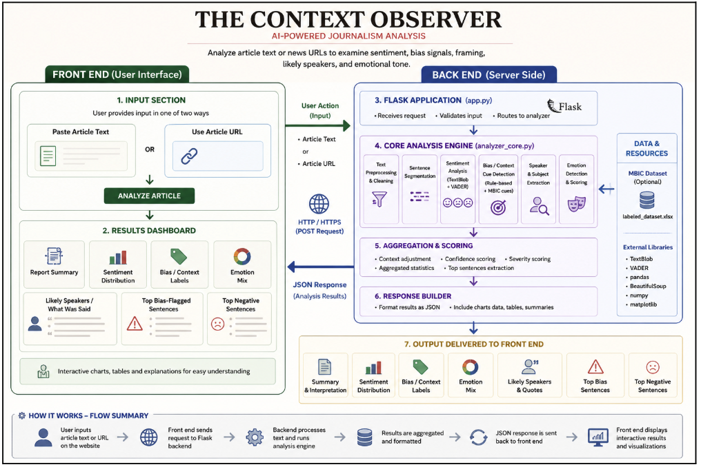

# The Context Observer  
### AI-powered journalism analysis

The Context Observer is an interactive journalism analysis tool that examines article text or public news URLs for sentiment, bias/context cues, likely speakers, subject focus, and estimated emotional tone.

## Live Demo

Use the web app here:

https://ai-journalism-bias-analyzer.onrender.com

## System Overview

<p align="center">
  
</p>

## Use the Web App

The easiest way to use the tool is through the hosted web version.

1. Open the live demo link.
2. Choose one input option:
   - **Paste article text**
   - **Use article URL**
3. Click **Analyze Article**
4. Review the generated report:
   - overall interpretation
   - sentiment distribution
   - bias/context labels
   - emotion mix
   - likely speakers
   - top bias-flagged sentences
   - top negative sentences

**Note:** Some news websites may block URL scraping. If URL mode fails, copy and paste the article text instead.

## Project Overview

This project combines a notebook-based research workflow with a Flask web application.

The analyzer uses:

- TextBlob sentiment scoring
- VADER sentiment scoring
- rule-based bias/context cue detection
- MBIC-informed cue expansion
- sentence-level analysis
- lightweight speaker and subject extraction
- visual summaries using charts

The goal is not to claim perfect bias detection, but to provide an explainable prototype for studying how sentiment, framing, context, and bias cues appear in journalism.

## Using or Extending the Project

You do not need to run anything locally to use the tool. The main version is available through the hosted web application.

However, if you want to modify or extend the project, you can fork or download the repository.

### Fork the Repository

1. Click **Fork** at the top right of this GitHub page.
2. GitHub will create your own copy of the project.
3. You can then edit, test, or deploy your own version.

### Download the Project

1. Click the green **Code** button.
2. Select **Download ZIP**.
3. Extract the folder and explore the files.

## Limitations

This is a research-oriented analysis tool, not a definitive bias detector.

Known limitations:

1. URL scraping may fail on protected or dynamic webpages.
2. Pasted text may include noise if copied directly from full webpages.
3. Sarcasm and deeper multi-sentence framing are only partially captured.
4. Speaker detection is heuristic and may not always identify the correct speaker.
5. Confidence values are estimated scores, not formally validated accuracy values.
6. Bias/context labels should be interpreted as analysis cues, not final judgments.

## Intended Use

This tool is designed for:

1. Exploring how sentiment and framing appear in news articles
2. Comparing human interpretation with AI-generated analysis
3. Studying bias-related signals in journalism
4. Demonstrating explainable NLP pipelines
5. Supporting research discussions and prototypes

## Repository Structure

```text
The-Context-Observer_AI-powered-journalism-analysis/
├── app/
│   ├── app.py
│   ├── analyzer_core.py
│   ├── templates/
│   │   └── index.html
│   └── static/
│       ├── styles.css
│       └── app.js
├── data/
│   └── labeled_dataset.xlsx
├── notebooks/
│   └── article_bias_analyzer_v4_professional.ipynb
├── reports/
│   └── testing_notes.md
├── requirements.txt
├── runtime.txt
├── render.yaml
├── system_architecture.png
└── README.md
```

## Deployment

The live web app is deployed using Render.

- Backend: Flask / Python
- Frontend: HTML, CSS, JavaScript
- Charts: Chart.js
- Dataset support: optional MBIC-informed cue expansion
- Hosting: Render
- Repository: GitHub

The Render start command is:

```bash
gunicorn --chdir app app:app
```

## License

This repository is provided for research, educational, and demonstration purposes.
